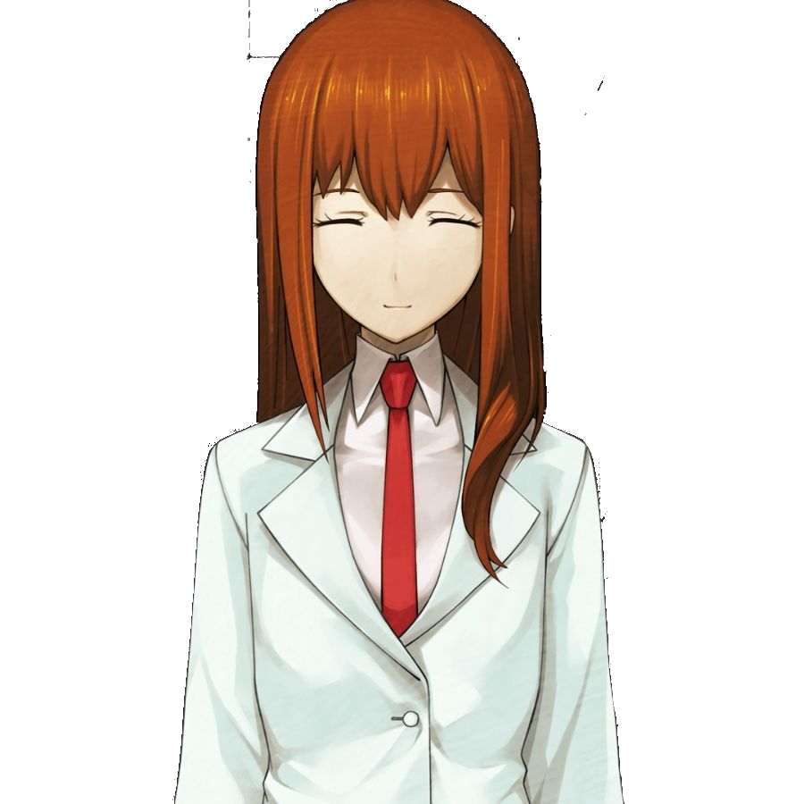

# Project M
## Experimental Discord bot 

## Description

An experimental bot for Discord with various common functionalities based on Kurisu/Amadeus from Steins;Gate. We plan on implementing multiple capabilities such as a basic chat capacity, some degree of responsiveness to user inputs, discord games, image reacting, etc.

We'd also plan to to model our bot's answers and behaviour around Kurisu/Adameus' personality, provinding a user imersive experience as if they were themselves intecating with her. So we'll keep in mind her being a *tsundere*. Possibly, we'll implement some sort of calibration to her agressiveness and shyness, based on storage of the user's previous inputs.

